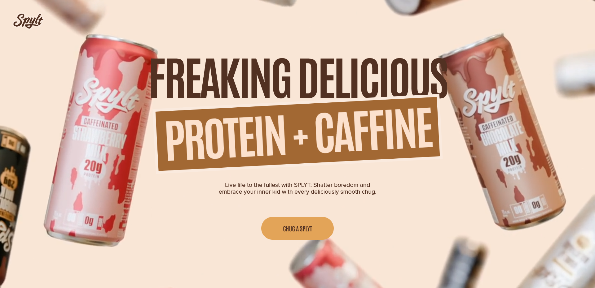
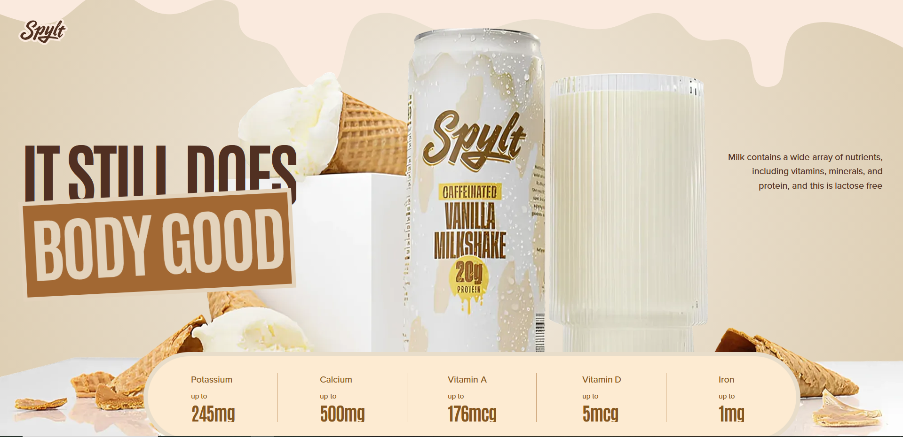
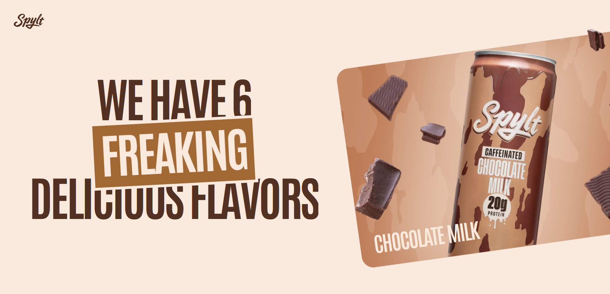
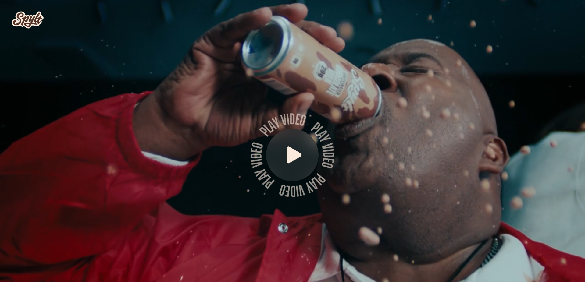

<div align="center">

# 🥛 Splyt — Freaking Delicious Caffeinated Flavor Milk

A modern, animated product landing page for **Splyt** caffeinated flavored milk — built with **React**, **GSAP**, and **Tailwind CSS**. Featuring smooth scroll-driven animations, horizontal flavor carousels, and cinematic video sections.

[](https://react.dev/)
[](https://gsap.com/)
[](https://tailwindcss.com/)
[](https://vite.dev/)

</div>

---

## 📸 Screenshots

### Hero Section

The landing hero features a video background with floating product cans and bold typography animations.



### Nutrition Details

Nutrition section with animated product imagery, nutrient facts bar, and radial gradient background.



### Flavor Carousel

A horizontal scroll-driven flavor showcase displaying all 6 delicious flavors with dynamic tilted cards.



### Video Section

Full-screen cinematic video section with an expanding circle reveal animation triggered by scroll.



---

## ✨ Features

- 🎬 **Scroll-driven animations** — GSAP ScrollTrigger powers smooth parallax, pinning, and reveal effects
- 🥤 **Horizontal flavor carousel** — Scroll vertically to browse 6 flavors horizontally with tilted card layouts
- 🎥 **Video backgrounds** — Hero and benefits sections with embedded video and circular reveal animations
- 📱 **Fully responsive** — Adapts seamlessly from mobile to desktop with conditional rendering
- ⚡ **Smooth scrolling** — GSAP ScrollSmoother for buttery-smooth scroll experience
- 🎨 **Bold typography** — Antonio font with animated text splits, clip-path reveals, and staggered character animations
- 💬 **Testimonials** — Fan video testimonial cards with unique rotations and stacking layouts

---

## 🛠️ Tech Stack

| Technology           | Purpose                                                     |
| -------------------- | ----------------------------------------------------------- |
| **React 19**         | Component-based UI                                          |
| **GSAP 3.13**        | Scroll animations, ScrollTrigger, ScrollSmoother, SplitText |
| **Tailwind CSS 4**   | Utility-first styling                                       |
| **Vite 6**           | Fast development & build                                    |
| **react-responsive** | Responsive breakpoint hooks                                 |

---

## 🚀 Getting Started

### Prerequisites

- **Node.js** ≥ 18
- **npm** ≥ 9

### Installation

```bash
# Clone the repository
git clone https://github.com/WhiiteRose/Splyt.git
cd Splyt

# Install dependencies
npm install

# Start development server
npm run dev
```

The app will be available at `http://localhost:5173`.

### Build for Production

```bash
npm run build
npm run preview
```

---

## 📁 Project Structure

```
Splyt/
├── public/
│   ├── fonts/          # Custom ProximaNova font
│   ├── images/         # Product images, backgrounds, SVGs
│   ├── videos/         # Hero, pin, and testimonial videos
│   └── screenshots/    # README screenshots
├── src/
│   ├── components/     # Reusable components (NavBar, FlavorSlider, etc.)
│   ├── constants/      # Flavor, nutrient, and testimonial data
│   ├── sections/       # Page sections (Hero, Message, Flavour, etc.)
│   ├── App.jsx         # Main app with ScrollSmoother setup
│   ├── index.css       # Global styles, Tailwind config, animations
│   └── main.jsx        # React entry point
└── index.html
```

---

## 🎨 Sections Overview

| Section          | Description                                            |
| ---------------- | ------------------------------------------------------ |
| **Hero**         | Video background, animated title, CTA button           |
| **Message**      | Scroll-revealed text with word-by-word color animation |
| **Flavors**      | Horizontal scroll carousel with 6 flavor cards         |
| **Nutrition**    | Radial gradient background with nutrition facts bar    |
| **Benefits**     | Stacked animated titles with video circle reveal       |
| **Testimonials** | Fan video cards with stacking layout                   |
| **Footer**       | Social links, email input, and copyright               |

---

<div align="center">

Made with ❤️ by **WhiiteRose**

</div>
